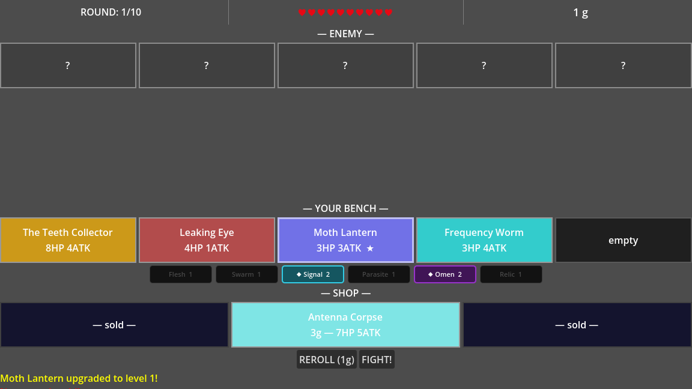

# Horror Battler

A dark auto-battler demo alpha. Cursed creatures. Grotesque synergies. Watch them murder each other.

**▶ [Play in your browser](https://r055le.github.io/horror-battler/)** — no install, no clone, nothing to download.

---



---

## What it is

Turn-based auto-battler in the vein of Super Auto Pets, except everything on your bench is wrong. You shop for units with names like "Crawling Molar" and "The Teeth Collector," position them on a 5-slot bench, and hit fight. They handle the rest.

10 rounds. Pre-built enemy lineups that scale up. You lose health equal to surviving enemy units after each loss. Reach 0 HP and you're done. Survive all 10 and you win.

The tone is dark and a little funny. The humor comes from min-maxing synergies between grotesque things.

---

## How it plays

**Shop phase** — 3 units offered each round from a tiered pool. Buy for 1–3 gold depending on tier. Sell any bench unit back for 1 gold. Reroll the shop for 1 gold. Max 5 units on your bench.

**Upgrade system** — Buying a duplicate of a unit you already own merges them. First merge: +50% HP and ATK. Second merge: +100% from base stats. Upgraded units show ★ indicators and a glowing border.

**Arrange phase** — Drag bench slots to reorder. Front units absorb hits first. Back units live longer. Position matters for ability interactions (copy_behind_atk, signal_first).

**Combat phase** — Fully automated. Units attack in slot order, alternating sides (Player 1, Enemy 1, Player 2, Enemy 2...). Each unit targets the frontmost living enemy unless an ability overrides it. Pre-combat abilities fire first, then synergy bonuses apply, then the fighting starts.

**Gold economy** — Starts at 10 gold per round. Gains +1 per win streak up to +3 bonus. Budget accordingly.

**Result** — Win/loss screen shows kills, max win streak, and damage taken. Restart from the same screen.

---

## Unit Roster

### Tier 1 (1 gold)

| Unit | HP | ATK | Tags | Ability |
|------|-----|-----|------|---------|
| Crawling Molar | 3 | 1 | Flesh, Swarm | — |
| Moth Lantern | 2 | 2 | Signal, Swarm | On death: deal 1 damage to the attacker |
| Leaking Eye | 4 | 1 | Flesh, Omen | — |
| Rust Tick | 2 | 1 | Parasite, Swarm | Combat start: steal 1 ATK from front enemy |

### Tier 2 (2 gold)

| Unit | HP | ATK | Tags | Ability |
|------|-----|-----|------|---------|
| Bone Radio | 5 | 3 | Signal, Relic | Combat start: all other Signal allies gain +1 ATK |
| Gut Prophet | 6 | 2 | Flesh, Omen | On ally death: gain +2 ATK |
| Host Sleeve | 4 | 2 | Parasite, Flesh | Combat start: copy ATK of the unit directly behind it |
| Frequency Worm | 3 | 4 | Parasite, Signal | Always attacks the lowest-HP enemy instead of front |

### Tier 3 (3 gold)

| Unit | HP | ATK | Tags | Ability |
|------|-----|-----|------|---------|
| The Teeth Collector | 8 | 4 | Relic, Omen | On kill: permanently gain +1 HP |
| Antenna Corpse | 7 | 5 | Signal, Relic | All your Signal units attack before all other units |

---

## Synergy System

Synergies activate at the start of combat when you have 2+ units sharing a tag. 3+ unlocks a stronger bonus. Bonuses stack on top of base stats before fighting begins.

| Tag | 2-Unit Bonus | 3-Unit Bonus |
|-----|-------------|-------------|
| **Flesh** | Flesh units +1 HP | Flesh units regenerate 1 HP after each attack |
| **Swarm** | Swarm units +1 ATK | Swarm units attack twice (second hit at half ATK) |
| **Signal** | Signal units +1 ATK | Signal units can't be targeted until a non-Signal ally dies |
| **Parasite** | Parasite units steal 1 HP on hit | Parasite units steal 1 ATK on hit (permanent for the round) |
| **Omen** | All units +1 HP | On any ally death, all surviving allies gain +1 ATK |
| **Relic** | All units +1 ATK | Relic units take 1 less damage from all attacks (min 1) |

Active synergies are displayed at the bottom of the screen with counts. Units with active synergy bonuses glow during combat.

---

## Enemy Rounds

| Round | Enemy Lineup | Notes |
|-------|-------------|-------|
| 1 | 1× Crawling Molar | Tutorial punching bag |
| 2 | 2× Leaking Eye | Slightly tankier |
| 3 | 1× Rust Tick, 1× Moth Lantern | Introduces abilities |
| 4 | 2× Crawling Molar, 1× Bone Radio | First enemy synergy (Signal + Flesh) |
| 5 | 3× Frequency Worm | Swarm of targeted attackers |
| 6 | 2× Gut Prophet, 1× Moth Lantern | Omen synergy, snowballs fast |
| 7 | 2× Host Sleeve, 2× Rust Tick | Parasite synergy, stat theft |
| 8 | 1× Antenna Corpse, 2× Bone Radio, 1× Moth Lantern | Full Signal comp |
| 9 | 1× Teeth Collector, 2× Gut Prophet, 1× Leaking Eye | Omen + Relic, scaling threats |
| 10 | 1× Teeth Collector (15 HP / 8 ATK), 2× Antenna Corpse, 2× Frequency Worm | Boss round |

Enemy units are hidden until combat starts.

---

## Combat Damage Formula

```
damage = attacker.ATK - target.damage_reduction
minimum damage = 1
```

Stat changes from abilities and synergies (ATK steals, kill rewards, on-death triggers) are permanent for the duration of combat but reset between rounds — except abilities that say "permanently."

---

## How to Run

1. Clone the repo
2. Open [Godot 4.x](https://godotengine.org/) → Import Project → point it at the project folder
3. Hit Play

No dependencies. No export needed. Just the engine and the project folder.

Tested on Godot 4.3. Probably fine on any 4.x release.

---

## Code Structure

```
scripts/
├── game_manager.gd   — state machine (SHOP → COMBAT → RESULT), UI, gold/health
├── combat.gd         — pure combat resolution, returns structured event list
├── combat_animator.gd — plays back combat events with tweens and await
├── synergy.gd        — applies synergy bonuses and passive flags pre-combat
├── unit_data.gd      — all unit stats, ability descriptions, tag colors
└── enemy_rounds.gd   — pre-built enemy lineups for all 10 rounds
```

Combat resolution is separated from animation intentionally — `combat.gd` runs instantly and returns a log of events, `combat_animator.gd` replays them with visual feedback. Makes it easy to test without needing a running scene.

---

## Tech Stack

- [Godot 4.x](https://godotengine.org/) — engine
- GDScript — all game logic
- [Claude Code](https://claude.ai/code) — built almost entirely with it

---

## Status

Demo alpha. The core loop works: shop, bench, fight, repeat, 10 rounds, win/loss screen. Art is colored rectangles with stat labels. No audio. No portraits. No export build.

This was a proof-of-concept to see if the loop was fun. It is. Further development TBD.
